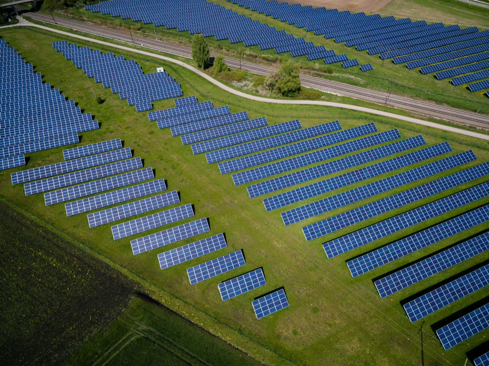

# Forecasting Solar power generation with XGBoost 
      

In this project we will be using historic data of Photovoltaic Solar power generation in Belgium to forecast its values in the future in three different horizons (1h, 24h and one week), in the accompanying [notebook](forecasting_PV_power_generation_in_Belgium_with_XGBoost.ipynb). 

*   Exploratory Data Analysis
      * Analysing time-series data and dealing with missing values
*   Feature Engineering
      * Using lagged features and calendar featues to create X,y pairs  
*   XGBoost
      * Bayesian Hyperparamter tuning of 3 XGBoost models simultaneously with Optuna
*   Conclusion
      * Performance Evaluation Against ELIA's own forecasting models

Dataset of historic solar pv power generation in Belgium is extracted from [ELIA.be](https://www.elia.be/en/grid-data/power-generation/solar-pv-power-generation-data) website and added to this repo as [ELIA_Belgium_Data_PV_output.csv](ELIA_Belgium_Data_PV_output.csv). 

For questions :

send me an email at : 📧 hamzarabi303@gmail.com 

contact me on :   

